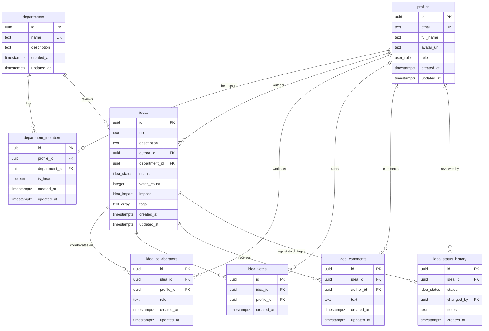

# IdeaHub Relational Database Design Documentation

This document describes the complete, production-ready relational database architecture designed for **IdeaHub** on Supabase.

---

## 1. Overview
The database is built on PostgreSQL inside Supabase, utilizing strict foreign key constraints, PostgreSQL custom ENUM types, RLS security policies, and performance indexes. Standard audit fields (`created_at`, `updated_at`) are automatically maintained via triggers on all mutable tables.

---

## 2. Mermaid Entity-Relationship (ER) Diagram

---

## 3. Database Schema

### PostgreSQL ENUM Types

1. **`public.user_role`**: Enforces strict roles inside the application.
   - Values: `'junior_member'`, `'department_head'`, `'administrator'`
2. **`public.idea_status`**: Enforces the workflow lifecycle phases.
   - Values: `'Draft'`, `'Submitted'`, `'In Review'`, `'Needs Collaboration'`, `'Approved'`, `'In Implementation'`, `'Completed'`
3. **`public.idea_impact`**: Enforces standard impact assessment levels.
   - Values: `'Low'`, `'Medium'`, `'High'`

---

### Table Descriptions

#### 1. `profiles` Table
* **Purpose**: Extends Supabase's internal `auth.users` system, storing human-readable details (names, avatars, role permissions) exposed to other club members.
* **Columns**:
  * `id` (uuid, Primary Key): References `auth.users(id)` with cascading deletion.
  * `email` (text, Unique, Not Null): Cache of authentication email.
  * `full_name` (text, Not Null): User's profile display name.
  * `avatar_url` (text, Nullable): URL to profile image.
  * `role` (user_role, Not Null): Defaults to `'junior_member'`.
  * `created_at` (timestamptz, Not Null): Account creation date.
  * `updated_at` (timestamptz, Not Null): Last profile update.
* **Relationships**:
  * Reference to `auth.users(id)` exists to extend authentication credentials with profiles.
* **Indexes**:
  * `idx_profiles_role` (B-Tree): Created on `role` to optimize permission checks in security helpers.

#### 2. `departments` Table
* **Purpose**: Registers all official club departments (e.g. Technical, Content, PR).
* **Columns**:
  * `id` (uuid, Primary Key): Unique identifier.
  * `name` (text, Unique, Not Null): Name of the department.
  * `description` (text, Nullable): Short description of responsibilities.
  * `created_at` / `updated_at` (timestamptz, Not Null): Standard audit fields.
* **Relationships**:
  * Independent dictionary table.

#### 3. `department_members` Table
* **Purpose**: Join table representing club memberships. Enables role division by marking who is a standard department member versus a department head.
* **Columns**:
  * `id` (uuid, Primary Key): Unique identifier.
  * `profile_id` (uuid, Foreign Key): References `profiles(id)` on delete cascade.
  * `department_id` (uuid, Foreign Key): References `departments(id)` on delete cascade.
  * `is_head` (boolean, Default false): Flag marking department managers.
  * `created_at` / `updated_at` (timestamptz, Not Null): Standard audit fields.
* **Constraints**:
  * Unique constraint on `(profile_id, department_id)` to prevent double department records.
* **Relationships**:
  * Relates profiles to departments (Many-to-Many).
* **Indexes**:
  * `idx_department_members_ids` (B-Tree): Composite index on `(profile_id, department_id)` for quick membership lookups.

#### 4. `ideas` Table
* **Purpose**: Core entity. Stores all proposal concepts, details, tags, author, and current status.
* **Columns**:
  * `id` (uuid, Primary Key): Unique identifier.
  * `title` (text, Not Null): Proposal headline.
  * `description` (text, Not Null): Proposal problem statement and solution.
  * `author_id` (uuid, Foreign Key): References `profiles(id)` on delete cascade.
  * `department_id` (uuid, Foreign Key): References `departments(id)` on delete set null.
  * `status` (idea_status, Default 'Draft'): Review phase status.
  * `votes_count` (integer, Default 0): Cached upvote count for list sorting.
  * `impact` (idea_impact, Default 'Medium'): Impact rating.
  * `tags` (text[], Default '{}'): Categories tags array.
  * `created_at` / `updated_at` (timestamptz, Not Null): Standard audit fields.
* **Relationships**:
  * References `profiles(id)` to identify the author (Many-to-One).
  * References `departments(id)` to route the proposal to a department review queue (Many-to-One).
* **Indexes**:
  * `idx_ideas_author` (B-Tree): Speeds up fetching "My Ideas" lists.
  * `idx_ideas_department` (B-Tree): Speeds up department queue queries.
  * `idx_ideas_status` (B-Tree): Speeds up dashboard filtering of reviews/active ideas.
  * `idx_ideas_tags` (GIN): Optimizes searching ideas by tag keywords.

#### 5. `idea_collaborators` Table
* **Purpose**: Connects users to projects during the implementation sprint.
* **Columns**:
  * `id` (uuid, Primary Key): Unique identifier.
  * `idea_id` (uuid, Foreign Key): References `ideas(id)` on delete cascade.
  * `profile_id` (uuid, Foreign Key): References `profiles(id)` on delete cascade.
  * `role` (text, Default 'Contributor'): E.g. 'Lead', 'Developer', 'Designer'.
  * `created_at` / `updated_at` (timestamptz, Not Null): Audit fields.
* **Constraints**:
  * Unique constraint on `(idea_id, profile_id)` to prevent duplicate team members.
* **Relationships**:
  * Join table connecting ideas to profiles (Many-to-Many).
* **Indexes**:
  * `idx_idea_collaborators_ids` (B-Tree): Composite index on `(idea_id, profile_id)` to speed up team lookup.

#### 6. `idea_votes` Table
* **Purpose**: Tracks upvotes cast on ideas. Restricts users to one upvote per idea.
* **Columns**:
  * `id` (uuid, Primary Key): Unique identifier.
  * `idea_id` (uuid, Foreign Key): References `ideas(id)` on delete cascade.
  * `profile_id` (uuid, Foreign Key): References `profiles(id)` on delete cascade.
  * `created_at` (timestamptz, Not Null): Vote timestamp.
* **Constraints**:
  * Unique constraint on `(idea_id, profile_id)` to enforce single voting per member.
* **Relationships**:
  * Join table connecting ideas to profiles (Many-to-Many).
* **Indexes**:
  * `idx_idea_votes_ids` (B-Tree): Optimizes validation checks to determine if the user has already voted on the idea.

#### 7. `idea_comments` Table
* **Purpose**: Stores discussion feed comments on proposals.
* **Columns**:
  * `id` (uuid, Primary Key): Unique identifier.
  * `idea_id` (uuid, Foreign Key): References `ideas(id)` on delete cascade.
  * `author_id` (uuid, Foreign Key): References `profiles(id)` on delete cascade.
  * `text` (text, Not Null): Comment contents.
  * `created_at` / `updated_at` (timestamptz, Not Null): Audit fields.
* **Relationships**:
  * References `ideas` and `profiles` (Many-to-One).
* **Indexes**:
  * `idx_idea_comments_idea` (B-Tree): Speeds up loading comments associated with an idea.

#### 8. `idea_status_history` Table
* **Purpose**: Audit log tracking state changes. Feeds the timeline details view.
* **Columns**:
  * `id` (uuid, Primary Key): Unique identifier.
  * `idea_id` (uuid, Foreign Key): References `ideas(id)` on delete cascade.
  * `status` (idea_status, Not Null): New status state.
  * `changed_by` (uuid, Foreign Key): References `profiles(id)` on delete set null.
  * `notes` (text, Nullable): Review notes or justification.
  * `created_at` (timestamptz, Not Null): Audit timestamp.
* **Relationships**:
  * References `ideas` (Many-to-One) and `profiles` (Many-to-One).
* **Indexes**:
  * `idx_idea_status_history_idea` (B-Tree): Speeds up fetching the historical timeline of status transitions for an idea.

---

## 4. Row Level Security (RLS)

### Helper Functions

1. **`public.get_current_user_role()`**: Exposes the user's role from the profiles table.
2. **`public.is_department_head(dept_id)`**: Checks if the user is a head of the specified department.

---

### Policies

#### 1. `profiles` Table
* **SELECT**: `auth.role() = 'authenticated'`
  * *Why*: Members must see other users' details to display name/avatar badges in discussions and cards.
* **INSERT/UPDATE**: `auth.uid() = id`
  * *Why*: Users can only manage their own profile details.

#### 2. `departments` & `department_members`
* **SELECT**: `auth.role() = 'authenticated'`
  * *Why*: Required to list departments and team associations.
* **INSERT/UPDATE/DELETE**: `get_current_user_role() = 'administrator'`
  * *Why*: Restricts admin operations to admins only.

#### 3. `ideas` Table
* **SELECT**: `status != 'Draft' OR author_id = auth.uid() OR get_current_user_role() = 'administrator'`
  * *Why*: Protects drafts, keeping them private to their author and administrators until they are submitted or reviewed.
* **INSERT**: `auth.uid() = author_id`
  * *Why*: Asserts that users can only submit ideas under their authenticated credentials.
* **UPDATE**: `(author_id = auth.uid() and status in ('Draft', 'Submitted')) or is_department_head(department_id) or get_current_user_role() = 'administrator'`
  * *Why*: Authors can update drafts/submissions. Department Heads can update ideas in their own department (to approve them). Admins have universal access.
* **DELETE**: `(author_id = auth.uid() and status = 'Draft') or get_current_user_role() = 'administrator'`
  * *Why*: Authors can delete drafts; other workflow states can only be deleted by admins.

#### 4. `idea_collaborators` Table
* **SELECT**: `auth.role() = 'authenticated'`
  * *Why*: Team member list is viewable by all authenticated club members.
* **ALL**: `exists (owner) or exists (dept head) or get_current_user_role() = 'admin'`
  * *Why*: Access to add/remove team members is restricted to the idea author, their department head, or admins.

#### 5. `idea_votes` Table
* **SELECT**: `auth.role() = 'authenticated'`
  * *Why*: Vote counts are public.
* **INSERT/DELETE**: `auth.uid() = profile_id`
  * *Why*: Members can only toggle their own vote records.

#### 6. `idea_comments` Table
* **SELECT**: `exists (visible idea)`
  * *Why*: Prevents access to comments left on private drafts belonging to other users.
* **INSERT**: `auth.uid() = author_id and exists (visible idea)`
  * *Why*: Users can only write comments under their own profile.
* **UPDATE/DELETE**: `auth.uid() = author_id or get_current_user_role() = 'administrator'`
  * *Why*: Comments are editable by their author, and deletions can be performed by the author or admins.

#### 7. `idea_status_history` Table
* **SELECT**: `auth.role() = 'authenticated'`
  * *Why*: The history timeline is visible to all authenticated users.
* **INSERT**: `changed_by = auth.uid() and (get_current_user_role() = 'administrator' or exists (owner or head))`
  * *Why*: Audit trails are created by reviewers or authors during state transitions.
* **UPDATE/DELETE**: `using (false)`
  * *Why*: Retains the integrity of the audit history log by preventing updates or deletions.

---

## 5. Triggers

1. **`tr_..._updated_at`** (before update):
   * Executed on: `profiles`, `departments`, `department_members`, `ideas`, `idea_collaborators`, `idea_comments`.
   * Action: Sets `updated_at = now()` automatically.
2. **`tr_idea_vote_change`** (after insert or delete):
   * Executed on: `idea_votes`.
   * Action: Increments (`votes_count = votes_count + 1`) or decrements (`votes_count = votes_count - 1`) the cached vote counter on the `ideas` table, keeping lists performant.

---

## 6. Future Expansion Notes

* **Idea Attachments**: The schema can support an `idea_attachments` table with columns (`id`, `idea_id`, `file_name`, `file_url`, `file_size`, `created_at`) referencing Supabase storage buckets.
* **Notifications Engine**: A `notifications` table (`id`, `profile_id`, `title`, `message`, `read_at`, `link`, `created_at`) can track workflow alerts (e.g. "Your idea was approved").
* **Comments Replies**: Can add a `parent_comment_id uuid references public.idea_comments(id)` to support comment nesting.
